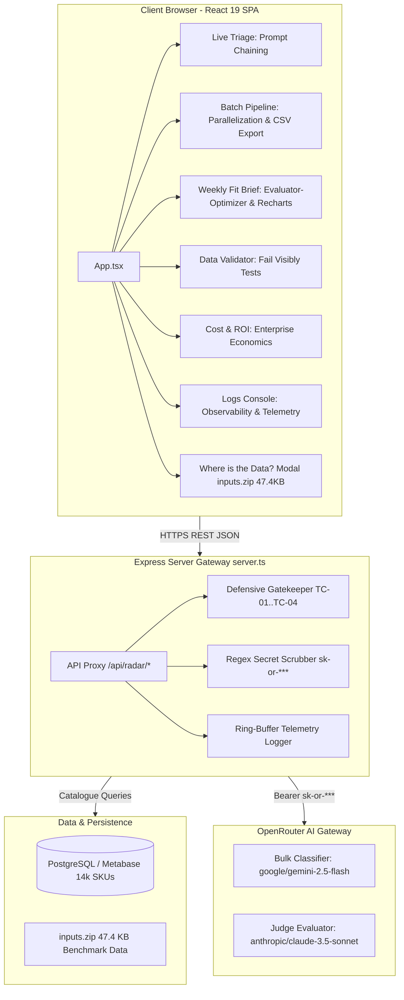
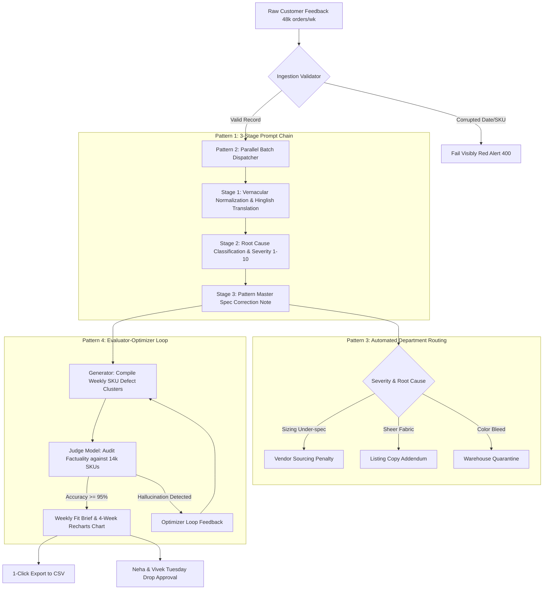

# Developer Guide — Dhaga & Co. Intelligence Radar

## 1. System Architecture Diagram

```
┌──────────────────────────────────────────────────────────────────────────────────────────────────┐
│                                     PRESENTATION TIER (Browser)                                  │
│                                                                                                  │
│   ┌──────────────────────────────────────────────────────────────────────────────────────────┐   │
│   │                        React 19 SPA (TypeScript + Tailwind CSS + Recharts)               │   │
│   │                                                                                          │   │
│   │   [Top Nav & Security Modal]  [Where is the Data? Modal (inputs.zip 47.4 KB, DB, CSV)]   │   │
│   │                                                                                          │   │
│   │   Tab 1: Live Triage        Tab 2: Batch Pipeline      Tab 3: Weekly Fit Brief           │   │
│   │   (3-Stage Prompt Chain)    (Parallel Hub Scores)      (Evaluator + 4-Wk Line Chart)     │   │
│   │                                                                                          │   │
│   │   Tab 4: Data Validator     Tab 5: Cost & ROI Model    Tab 6: Observability Logs         │   │
│   │   (Fail Visibly Tests)      (Enterprise Economics)     (Telemetry & Error Simulator)     │   │
│   └─────────────────────────────────────────────┬────────────────────────────────────────────┘   │
└─────────────────────────────────────────────────┼────────────────────────────────────────────────┘
                                                  │
                                                  │ HTTPS REST /api/*
                                                  ▼
┌──────────────────────────────────────────────────────────────────────────────────────────────────┐
│                                 DEFENSIVE BACKEND PROXY (Node / Express)                         │
│                                                                                                  │
│   ┌──────────────────────────────────────────────────────────────────────────────────────────┐   │
│   │ server.ts Gateway & Middlewares                                                          │   │
│   │   ├── Ingestion Boundary Validator (TC-01 to TC-04: Fails Visibly before LLM calls)       │   │
│   │   ├── Regex Key Scrubber (Auto-redacts sk-or-*, Bearer tokens from console & ring buffers)   │   │
│   │   ├── Static Asset Distributor (/inputs.zip, /dhaga_returns_template.csv)               │   │
│   │   └── Telemetry Buffer (Tracks latency, token usage, USD/INR costs per endpoint)         │   │
│   └──────────────────────────────┬───────────────────────────────┬───────────────────────────┘   │
└──────────────────────────────────┼───────────────────────────────┼───────────────────────────────┘
                                   │                               │
            In-Memory / Read       │                               │ Secure Server-to-Server
            Replica SQL Calls      │                               │ Authorization: Bearer sk-or-***
                                   ▼                               ▼
┌──────────────────────────────────────────────┐   ┌───────────────────────────────────────────────┐
│              DATA STORAGE TIER               │   │              MODEL INFERENCE TIER             │
│                                              │   │                                               │
│  ├── PostgreSQL / Metabase Read-Replica      │   │  OpenRouter Gateway (openrouter.ai/api/v1)   │
│  │   (14,280 Active SKUs, Vendor Masters)    │   │                                               │
│  ├── Ingestion Benchmark Archive             │   │  [Fast Model: google/gemini-2.5-flash]        │
│  │   (inputs.zip - 47.4 KB authentic dumps)  │   │  - Cost: ~$0.075 / 1M tokens (~₹0.007/return) │
│  └── Ring-Buffer Telemetry Store             │   │  - Role: Bulk translation, zoning, routing   │
│      (Latest 500 audit logs & metrics)       │   │                                               │
│                                              │   │  [Judge Model: anthropic/claude-3.5-sonnet]  │
│                                              │   │  - Cost: ~$3.00 / 1M tokens                   │
│                                              │   │  - Role: Evaluator-Optimizer & audit checks   │
└──────────────────────────────────────────────┘   └───────────────────────────────────────────────┘
```

---

## 2. End-to-End Processing Flow Diagram (4-Pattern Intelligence Engine)

```
 [Raw Customer Return Stream]
 (48,000 orders/week · 31% return rate · 44% in unclassified "Other" dropdown)
                 │
                 ▼
 ┌─────────────────────────────────────────────────────────────────────────────────────────────────┐
 │ STEP 0: DEFENSIVE INGESTION VALIDATOR (Code vs. Model Boundary)                                 │
 │                                                                                                 │
 │ Check: return_date >= delivered_date ? SKU exists in 14k catalogue ? Duplicate claim detected?  │
 └───────────────────────────────┬─────────────────────────────────┬───────────────────────────────┘
                                 │                                 │
                     [PASS] Valid Record               [FAIL] Corrupted Record
                                 │                                 │
                                 ▼                                 ▼
 ┌────────────────────────────────────────────────┐   ┌────────────────────────────────────────┐
 │ PATTERN 2: PARALLEL DISPATCHER                 │   │ FAIL VISIBLY BANNER                    │
 │ Partition into concurrent vendor batches       │   │ Halt execution, return 400 Bad Request │
 │ (Jaipur Hub Kurtis vs. Tiruppur Knits)         │   │ Log exception to audit stream          │
 └───────────────────────┬────────────────────────┘   └────────────────────────────────────────┘
                         │
                         ▼
 ┌─────────────────────────────────────────────────────────────────────────────────────────────────┐
 │ PATTERN 1: 3-STAGE PROMPT CHAIN (Bulk Fast Model: gemini-2.5-flash)                            │
 │                                                                                                 │
 │   STAGE 1: Vernacular Normalization & Translation                                               │
 │   • Input: "Size M mangwaya tha par bust bohot tight hai aur rani gulabi color utar gaya"      │
 │   • Output: Standardized English + Pantone Normalized Color ("Fuchsia / Rani Pink")             │
 │                                 │                                                               │
 │                                 ▼                                                               │
 │   STAGE 2: Root Cause Classification & Severity Scoring                                         │
 │   • Garment Zone: Bust & Armhole Grading                                                        │
 │   • Root Cause: Sizing Defect (Under-spec) + Secondary Color Fastness Failure                   │
 │   • Defect Severity: 8 / 10 | Confidence: 94%                                                   │
 │                                 │                                                               │
 │                                 ▼                                                               │
 │   STAGE 3: Technical Spec Correction Note                                                       │
 │   • Pattern Master Directive: +1.5 inches bust ease on Size M; enforce ISO Level 4 wash fastness│
 └───────────────────────────────┬─────────────────────────────────────────────────────────────────┘
                                 │
                                 ▼
 ┌─────────────────────────────────────────────────────────────────────────────────────────────────┐
 │ PATTERN 3: AUTOMATED DEPARTMENT ROUTING                                                         │
 │                                                                                                 │
 │   ├── [Severity >= 8 & Vendor Sizing Under-spec] ──► Vendor Sourcing Penalty & Pattern Hold     │
 │   ├── [Unlined Sheer Georgette]                  ──► Listing Copy Addendum (Vivek)              │
 │   ├── [Major Lot Color Bleed]                    ──► Warehouse Quarantine (Faizan)              │
 │   └── [Subjective Buyer Remorse]                 ──► CX Instant Refund & Retention Voucher      │
 └───────────────────────────────┬─────────────────────────────────────────────────────────────────┘
                                 │
                                 ▼
 ┌─────────────────────────────────────────────────────────────────────────────────────────────────┐
 │ PATTERN 4: EVALUATOR-OPTIMIZER LOOP (Weekly Executive Synthesis)                                │
 │                                                                                                 │
 │   ┌──────────────────────────────────────────┐                                                  │
 │   │ Generator Model (gemini-2.5-flash)       │                                                  │
 │   │ Aggregates high-risk SKU defect clusters │                                                  │
 │   └────────────────────┬─────────────────────┘                                                  │
 │                        │ Synthesized Draft Brief                                                │
 │                        ▼                                                                        │
 │   ┌──────────────────────────────────────────┐                                                  │
 │   │ Judge Auditor Model (claude-3.5-sonnet)  │                                                  │
 │   │ Audits draft against 14k SKU catalogue   │                                                  │
 │   │ Checks: Hallucinations? Spec feasibility?│                                                  │
 │   └────────────────────┬─────────────────────┘                                                  │
 │                        │                                                                        │
 │          ┌─────────────┴─────────────┐                                                          │
 │          │ Passed (Accuracy >= 95%)  │ Failed / Flagged                                         │
 │          ▼                           ▼                                                          │
 │   Finalized Brief             Regenerate with feedback critique notes                           │
 └────────────────────────┬────────────────────────────────────────────────────────────────────────┘
                          │
                          ▼
 ┌─────────────────────────────────────────────────────────────────────────────────────────────────┐
 │ DOWNSTREAM EXECUTIVE DELIVERABLES                                                               │
 │                                                                                                 │
 │   1. Live React UI Dashboard & 4-Week Recharts Trend Line (W36 - W39)                           │
 │   2. 1-Click "Export to CSV" (18 parsed intelligence columns for Neha & Vivek)                  │
 │   3. Tuesday 400-SKU Factory Re-cutting Directives (Jaipur & Tiruppur pattern corrections)     │
 │   4. Annual Financial Impact: ₹59.9 Lakhs Logistics Saved vs. ₹2,600 LLM Bill (>1,000x ROI)     │
 └─────────────────────────────────────────────────────────────────────────────────────────────────┘
```

---

## 3. Mermaid Source Code

### System Architecture


### Pipeline Process Flow

